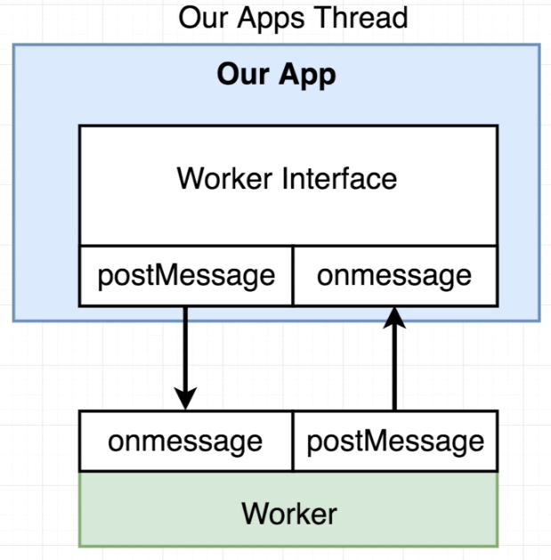

# Enhancing Node Performance

### Cluster Mode

It's used to start up multiple copies of Node that are all running your server inside them.
We cannot somehow trick Node to run into running with multiple threads, but by starting up multiple copies we get multiple instances of the Event Loop, so it vaguely works in a similar fashion making Node kind of "multi-threaded".

This is recommended.

It's important to note that _nodemon_ by default out of the box does not work very nicely with clustering.

### Worker Threads

The worker theads are going to use the _threadpool_ that is set up by _libuv_ whenever we start up our Node application.

#

# Blocking the Event Loop

Consider the _2_enhancing_node_performance/1_blockingEventLoop.js_ code, where a simple _express_ server has the following route:

    app.get("/", (req, res) => {
      /* This code is gonna be executed
        inside the Event Loop. This doesn't get
        thrown out to an Event Pool, it doesn't get
        handled by the OS or anything like that.
      */

      /* While processing, our Event Loop
        can do absolutely nothing else, i.e.
        it cannot handle other requests, database queries
        write files, etc*/
      doWork(5000); // 5s.

      res.send("Hi there");
    });

Let's make the 1st request using Firefox, which will take like 5s:

Then immediately make the 2nd request:

We'll see that the 2nd request takes 10s:

That's why we shouldn't do expensive or long operations inside the Event Loop.

# Node Clustering

We gonna have multiple Node processes and there's always going to be one parent process called the _**cluster manager**_.

The _**Cluster Manager**_ is responsible for monitorign health of individual instances of our application, that we're gonna launch at the same time on our computer. It doesn't actually execute any application code, isn't really responsible for handling incoming requests or fetching data from the database... Instead it manages the instances, can stop, start, send them data, restart them.

These instances run in a singular computer. Multiple instances running in one computer.

- When we start to use clustering, we're still going to run the app at command line using `node index.js`.
- Then Node will boot up our application by reading the contents of that file.
- But here is where things start to be different, the first instance of Node that gets launched is what we refer as the _cluster manager_.
- The _cluster manager_ is then responsible for starting up _worker instances_, and those _worker instances_ are actually responsible for processing those incoming requests.
- To create those _worker instances_ the _cluster manager_ is going to require in the _cluster_ module from the Node Standard Library.
- Whenever we call `cluster.fork()` function from within the _cluster manager_ Node internally goes back to our `index.js` file and it executes it a second time, but it executes it in a slightly different mode and starts our _worker instance_.

It's recommended to not create more children than the number of physical cores of your processor. So in general you want to match your number of children in your cluster to either the number of physical or logical cores that you have.

The **logical cores** refers to the topic of multi-threading, my computer is a four core machine, has four physical cores, but each core can process two threads at the same time, so 2 threads x 4 cores = 8 logical cores.

To learn more about clustering check the file inside playground _2_enhancing_node_performance/2_introToClustering.js_

# PM2

ADVANCED, PRODUCTION PROCESS MANAGER FOR NODE.JS

PM2 is a daemon process manager that will help you manage and keep your application online 24/7

PM2 is a production process manager for Node. js applications with a built-in load balancer. It allows you to keep applications alive forever, to reload them without downtime and to facilitate common system admin tasks.

PM2 is a cluster management solution, so it has everything having to do with spawning multiple instances of your application and managing the health of every single one of them.

### Start a cluster with PM2

`pm2 start <file> -i 0`

- `-i 0` lets pm2 determine the number of instances to create

### Close all instances

`pm2 delete all`

`pm2 delete <app_name>`

### List all instances

`pm2 list`

### Get more details about an app

`pm2 show <app_name>`

### Monitor the instances

`pm2 monit`

# Worker Threads

As you can see in the image, the application runs in its thread and the worker runs in its own.

To communicate with that separate thread we don't get to have like very direct means of conversartion per se with the work that is being done in the worker. That means that we cannot freely reference variables inside of the worker from our application. The only means for communication is that _onMessage/postMessage_ system.

The _Worker Interface_ is what we're gonna create inside our server, then it creates the _worker thread_ and we communicate back and forth between the two by using _postMessage/onMessage_.

_onMessage_ is a property that we're gonna assign a function to. That function will then be invoked anytime we call postMessage on the opposing site. If we call postMessage in our server, it's going to invoke onMessage inside the thread worker.

and if we call _postMessage_ from the worker thread, it will invoke onMessage, the one inside our Worker Interface.
