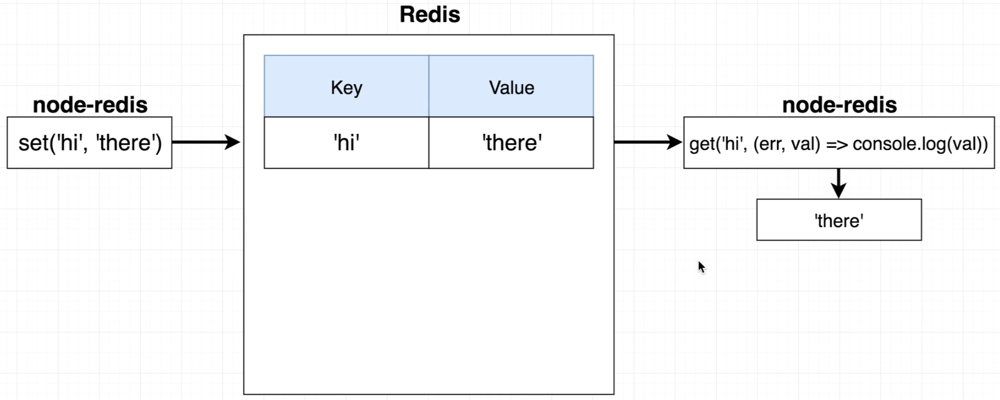

# Data Caching with Redis

Improve the read performance for a web server.

MongoDB use an _index_ for the _id_ property, but other properties don't use an _index_ by default. That means if you make a query where you use a property different to \__id_, the query will be more slow.

One solution might be creating a new index for the property in question, another one would be creating a _Cache Server_

# Caching Layer

Everytime we make a query, first the Cache Server will ask if that one has been executed before, if it hasn't then the query will reach the database and the database will send the data back to the server, but the Cache Server will store that data at the same time.

# Redis

In-memory data store, it's like a tiny database that runs in the memory of the machine and allows to read and write data very quickly.

Redis is a key-value store. We're goin to use the _node-redis_ library to manipulate by setting and getting the values that are stored inside Redis itself.

A simple way of adding a register to Redis is:  
`set("hi", "there")`

## Connection to Redis

    (async () => {
      const redis = require("redis");

      const client = redis.createClient({
        socket: {
          host: "containers-us-west-152.railway.app",
          port: 7926
        },
        password: "z8MDcTMJO4rc2Nfp6fum",
      });

      await client.connect();

      await client.set("name", "Enrique");
      console.log(`Your name is ${await client.get("name")}`);

      process.exit(0);
    })();

## Redis Hashes

A **hash** is another term for, essentially, the **objects** you are used to working with JS.

We can store _nested hashes_.

We use the following code to do it:

    // Store the value
    hset("spanish", "red", "rojo")

    // Get the value
    hget("spanish", "red", (err, val) => console.log(val))

We can store complex objects using `JSON.stringify()` to store and `JSON.parse()` to convert it back to a JS Object.

## Cache Keys

If we had to cache data from a route that retrieves the blogs from an specific user, we could use the user_id as a key.

